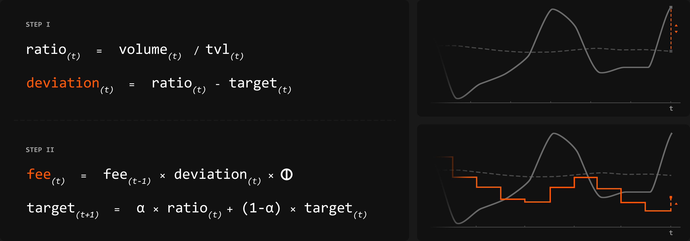

# Dynamic Fee

Traditional AMMs work with static fee tiers that remain constant regardless of market environment. Having multiple pools per asset pair leads to liquidity fragmentation and creates friction for Liquidity Providers who need to rebalance positions across tiers to earn optimally. Additionally, it hurts traders through an increase in slippage[^1].

Our dynamic fee algorithm enables a single, unified pool per asset pair in which fees respond to market activity. When volume increases relative to available liquidity, fees increase to reflect the increased demand. When markets quiet down, fees decrease to remain competitive.

The result is a fairer distribution of costs and rewards. Pools discover their natural equilibrium continuously based on actual usage patterns, creating a market-driven price discovery mechanism for liquidity where cost and reward naturally align with supply and demand dynamics.


Unified Pools become autonomous systems that self-regulate fees based on pool-internal data.


***

### The Algorithm

At the core of the algorithm sits the pool-internal Volume/TVL ratio, which acts as the primary signal to measure the demand a pool faces at each timestep. The algorithm steers fees to converge the daily ratio toward a target ratio that adapts to reflect the market environment the pool operates in.


The explanation below is simplified to convey the underlying logic. The production implementation includes additional safeguards and optimization.


<figure><figcaption>
The visualization shows how the algorithm processes market signals in two sequential steps
</figcaption></figure>


For more information on parameters and variables, please refer to [#dynamic-variables](dynamic-fee.md#dynamic-variables "mention") and [#pool-initialization](dynamic-fee.md#pool-initialization "mention")




#### Measure Deviation

The algorithm is executed once every 24 hours. It starts by calculating the current Volume / TVL ratio.

<figure><figcaption></figcaption></figure>

It then measures the deviation from the pool's adaptive target, which determines the direction and magnitude of fee adjustments.

<figure><figcaption></figcaption></figure>

This deviation then becomes the core signal that drives the adjustment mechanism. The first graph illustrates a rather extreme deviation, which will lead to a big increase in fees.



#### Dynamic Response

**First, fees adjust.** The previous fee is multiplied by the deviation and an adjustment mechanism Phi Φ. This factor incorporates dampening, consecutive threshold logic, and volatility-sensitive scaling. It prevents the algorithm from overreacting while maintaining responsiveness.

<figure><figcaption></figcaption></figure>

**Next, the target adapts.** Using an [exponential moving average](#user-content-fn-2)[^2], the algorithm recalculates the target ratio. The Alpha α parameter acts as a smoothing factor, defining how many days to remember, similar to a lookback period.

<figure><figcaption></figcaption></figure>

With that, the algorithm finishes the daily update. In the shown example, we are in a volatile market environment with volume spiking. Due to the positive, large deviation, the fee updates to the upside.




The algorithm uses pool-internal data (volume and TVL) to adjust fees.  This leads to competitive behaviour as seen in [#why-it-matters](dynamic-fee.md#why-it-matters "mention").


### Dynamic Variables

This section breaks down the three dynamic variables updated at each algorithm execution. These values capture the system's real-time state and drive fee adjustments in response to market conditions.

<table data-view="cards"><thead><tr><th></th><th></th><th data-hidden data-card-cover data-type="image">Cover image</th><th data-hidden></th><th data-hidden data-card-target data-type="content-ref"></th></tr></thead><tbody><tr><td><strong>Current Ratio</strong></td><td>Real-time Volume/TVL  ratio at algorithm execution</td><td><a href="../.gitbook/assets/Ratio.png">Ratio.png</a></td><td>Measures trading activity relative to pool size. Target of 1.0 indicates healthy balance.</td><td></td></tr><tr><td><strong>Target Ratio</strong></td><td>Exponential Moving Average tracking historical environment, α controls lookback period</td><td><a href="../.gitbook/assets/Target.png">Target.png</a></td><td>Set at 0.1 to control adjustment speed. Prevents wild swings while maintaining responsiveness.</td><td></td></tr><tr><td><strong>New Fee</strong></td><td>Calculated fee change modulated by Φ's dampening logic</td><td><a href="../.gitbook/assets/Fee.png">Fee.png</a></td><td>1.0% upper bound protects traders during extreme volatility while capturing value.</td><td></td></tr></tbody></table>

While these variables update with each execution, their underlying parameters (α sensitivity, Φ response function) are fixed at deployment. They are determined at pool initialization depending on the pool type.

<mark style="color:$info;">Pool Initialization</mark>

Before deployment, the algorithm requires a set of parameters. These are configured through backtesting against historical data and analysis of competing pools.


Initial Fee and Target Ratio set the algorithm's starting point. Both adjust as real market data becomes available and the algorithm runs.


<table data-view="cards"><thead><tr><th></th><th></th><th data-hidden data-card-cover data-type="image">Cover image</th></tr></thead><tbody><tr><td>Starting Point</td><td>Initial Fee and Target Ratio calibrated from historical patterns.</td><td><a href="../.gitbook/assets/Initial.png">Initial.png</a></td></tr><tr><td><strong>Alpha α</strong></td><td>Controls adaptation speed to regime changes</td><td><a href="../.gitbook/assets/Alpha.png">Alpha.png</a></td></tr><tr><td><strong>Phi Φ</strong></td><td>Linear slope, max delta, tolerance bands, consecutive thresholds</td><td><a href="../.gitbook/assets/Phi.png">Phi.png</a></td></tr></tbody></table>

The parameter set defines the algorithm's behaviour profile. The <mark style="color:$info;">Initial Target Ratio</mark> anchors the starting point, Alpha α determines how many days of historical data influence the current target and Phi Φ controls how fees respond to deviation.

***

Pool Initialisation plays a big role in how newly launched pools behave. For each pool, we follow a three-step process.

1. **Set Initial Fee and Target Ratio** by analyzing proxy pools and their historical Volume/TVL ratios
2. **Calibrate Alpha α and Phi Φ** by evaluating asset volatility and combination
3. **Simulate** competitive dynamics against existing pools to validate configuration


Simulations cannot guarantee outcomes. They validate parameter logic and stress-test configurations, but markets remain unpredictable.


<mark style="color:$info;">Pool Type</mark>

Pools are classified into three types based on asset correlation and implied volatility. Each type requires different parameter configurations to match its risk profile.


Typical Stable Pools exclusively inhabit the 0.01% tier. This illustrates the lesser need for fee adaptations, which presents itself through a lower <mark style="color:$primary;">Phi Φ</mark> in the algorithm.


| Pool Type | Asset Characteristics                     | Parameter Set |
| --------- | ----------------------------------------- | ------------- |
| Stable    | Correlated                                | Conservative  |
| Standard  | Uncorrelated                              | Balanced      |
| Volatile  | 
Uncorrelated

High Volatility
 | Aggressive    |

**Stable pools** experience minimal IL[^3]. Correlated assets move together predictably. The algorithm doesn't need to respond to volatility spikes, just price liquidity competitively. This translates to conservative parameters - lower Alpha α and restrained Phi Φ keep fees stable.

**Standard pools** face moderate IL[^3] as uncorrelated assets swing independently. Liquidity Providers require compensation for heightened risk exposure. Parameters are set to capture value during volatile periods while maintaining competitiveness.

**Volatile pools** represent an extremely volatile pool with severe IL[^3] exposure. The algorithm requires aggressive parameters - higher Alpha α adapts the target quickly to new volatility regimes, while amplified Phi Φ ensures fees rise appropriately to compensate LPs.


Volatility increase Impermanent Loss, requiring higher fee compensation to maintain LP profitability. This is why different Pool Types require different Parameter Sets.


### Why it Matters

**Liquidity Providers**

**Static fee tiers force LPs to guess** which single tier will maximize returns under expected market conditions. As the market changes, so does the optimal tier. LPs must withdraw and redeploy to a different tier. With each adjustment, gas fees and rebalancing costs accumulate. The operational overhead is discouraging retail from taking part.

**Alphix it.** Dynamic Fees eliminate the need for tier management. LPs can deposit into a single, unified pool where fees adjust algorithmically to market conditions. <mark style="color:$info;">No rebalancing. No tier speculation. No overhead.</mark> The algorithm optimizes the fee automatically, making liquidity provision accessible to everyone.


Earn the optimal fee. No rebalancing overhead.


**Traders**

**Static fee tiers fragment liquidity.** The same asset pair splits across multiple pools instead of consolidating into a single, deep market. When executing large trades, this fragmentation increases slippage, even if orders are routed via an aggregator through multiple pools.

**Alphix it.** Dynamic Fees eliminate fragmentation. All liquidity concentrates in a single pool, which adjusts fees based on market conditions. Traders benefit from deeper liquidity and better execution.


Better Execution. No liquidity fragmentation.


**Protocols**

**Static fee tiers create a suboptimal experience** for all pool users. LPs face rebalancing overhead. Traders encounter liquidity fragmentation. Protocols using traditional AMM infrastructure inherit these limitations, putting them at a competitive disadvantage.

**Alphix it.** Dynamic Fees would allow any protocol leveraging Unified Pools to offer a superior product to their users without added deployment complexity. This would differentiate them through better UX out of the gate while gaining access to the expanding suite of products through the <mark style="color:$info;">Alphix Hook</mark>.


Launch with Dynamic Fees. Scale with future products.


[^1]: Price impact from executing trades against available liquidity. <mark style="color:$info;">Large trades incur higher slippage than small ones.</mark>

[^2]: EMA - Weighted average favoring recent data

[^3]: **Impermanent Loss**

    The temporary loss from pooled assets diverging in price versus holding them separately.
