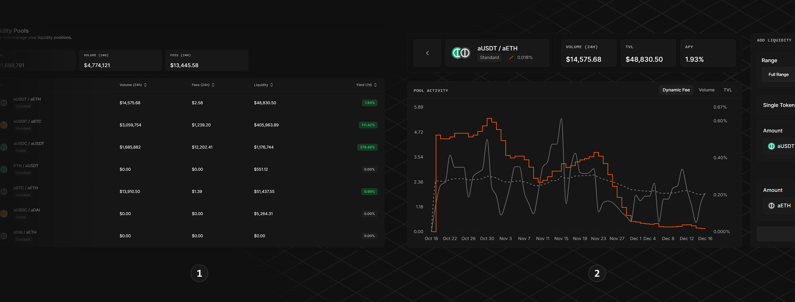

# Add Liquidity

The Liquidity section of the Alphix App is your hub for exploring and managing liquidity across all **Unified Pools**. It’s divided into two main views.

<figure><figcaption></figcaption></figure>



**Overview**

<mark style="color:$info;">This dashboard provides an overview of all Unified Pools. It displays key metrics like Total Value Locked (TVL), 24h Volume, 24h Generated Fees, and estimated APRs.</mark>\ <mark style="color:$info;">Filters can be used to quickly find pools by type, TVL, activity level or APR. The Overview is ideal for identifying where the deepest liquidity and best opportunities currently are.</mark>



**Pool-Specific View**

<mark style="color:$info;">Clicking on a pool takes the user to a dedicated page with full details for the selected market. This page consists of:</mark>

* <mark style="color:$info;">A larger, more detailed version of the Dynamic Fee Trend to help you understand recent volatility and fee adjustments.</mark>
* <mark style="color:$info;">Full historical breakdown of volume and TVL.</mark>
* <mark style="color:$info;">A clear overview of user position(s) in the pool, including current value, accumulated fees, time of creation, and range parameters. These Position Cards also allow users to increase, decrease or remove positions as well as claim accumulated fees.</mark>&#x20;
* <mark style="color:$info;">An interface to create new liquidity positions.</mark>



#### Adding + Managing Liquidity

Providing liquidity on Alphix is designed to feel as smooth as swapping but with more control. It’s also powered by Permit2 so that approvals are streamlined across all actions.

<figure><figcaption></figcaption></figure>



**Choose Price Range**&#x20;

<mark style="color:$info;">Alphix leverages Uniswap's Concentrated Liquidity Market Maker (CLMM) model. It enables custom price ranges in which deposited liquidity is concentrated instead of spreading all available liquidity across all prices. This increases capital efficiency and earns higher fees.</mark>


Concentrating liquidity comes with increased Impermanent Loss. We encourage users to research the topic, as the Rehypothecation and Rebalancing products are not activated during the initial launch phase.


<mark style="color:$info;">The 'Range' interface includes:</mark>

* <mark style="color:$info;">**Pre-set ranges**</mark> <mark style="color:$info;"></mark><mark style="color:$info;">for quick deployment (Full Range, Wide, Narrow)</mark>
* <mark style="color:$info;">**Custom range option**</mark> <mark style="color:$info;"></mark><mark style="color:$info;">for precise control; see below</mark>



**Input Amounts**

<mark style="color:$info;">Either token amount can be input by the user, and the corresponding token will be pre-filled.</mark>



**Deposit Liquidity**

<mark style="color:$info;">To confirm the new position, the user needs to complete an approval flow reminiscent of the</mark> [swap.md](swap.md "mention") <mark style="color:$info;">flow. For first deposits, it includes:</mark>

1. <mark style="color:$info;">Approval for Token A</mark>
2. <mark style="color:$info;">Approval for Token B</mark>
3. <mark style="color:$info;">Sign Batch Permits (gas-free) for both tokens at once</mark>

<mark style="color:$info;">These approvals cover all future additions of liquidity to that pool. After this initial setup, more capital can be added without repeating approvals, as long as it stays within the amounts and time period set in the permit.</mark>



**Zapping Liquidity**

Alphix allows users to zap liquidity. This means instead of requiring two tokens at a specific ratio depending on the chosen range and current price, a single token can be input and the correct, liquidity-maximizing swap is calculated to get the corresponding token.


Zapping adds an initial swap to the LP flow. This swap uses the preset user-set slippage if available. Otherwise, slippage is automatically calculated before execution. In case of high slippage, the user is notified to prevent bad surprises.




**Managing Positions**

<figure><figcaption></figcaption></figure>

**Claim Fees**

<mark style="color:$info;">Accumulated Fees can be claimed independently at any time without changing the position. No approval is required.</mark>

**Increase Liquidity**

<mark style="color:$info;">More capital can be added to an existing position. In that case any unclaimed fees will automatically be compounded. Depending on the amount, new approvals and a batch signature might be needed.</mark>

**Withdraw Liquidity**

<mark style="color:$info;">Users can withdraw parts of existing positions or the entire position, in which case the Position is burned. Accrued fees are automatically claimed alongside the withdrawal. No approvals are needed.</mark>



***

#### Liquidity Provisioning Risks


Providing liquidity carries risks that users should understand before committing capital. Alphix is designed to reduce these risks, but they cannot be eliminated.


**Impermanent Loss (IL)**

While providing liquidity, assets are exposed to price changes between the two tokens. If one token deviates significantly from the other, the value of the positions is lower than if the tokens were simply held in a wallet.

> IL is minimized when tokens are correlated (stablecoins)
>
> Setting a narrow, active price range increases fee income but also IL. Additionally if the price moves outside the specified range, the position stops earning and is entirely exposed in the devaluing token.
>
> Regular monitoring is a best practice and helps manage risks.

Read more about [<mark style="color:$info;">Impermanent Loss</mark>](https://blog.ston.fi/impermanent-loss-explained-a-guide-for-defi-liquidity-providers/).

**Smart Contract Risk**

Smart contracts carry inherent risk. We strongly encourage LPs to do their own research.&#x20;

Alphix is built on top of well-established protocols like Uniswap v4 and follows official standards. In addition, a clear audit roadmap ensures external experts review every release before mainnet deployment.
