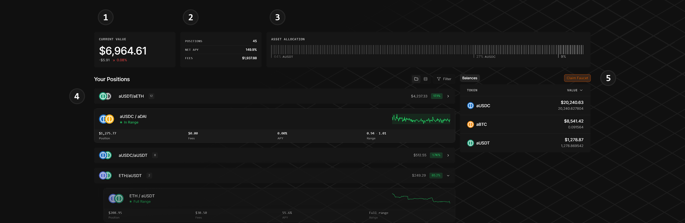
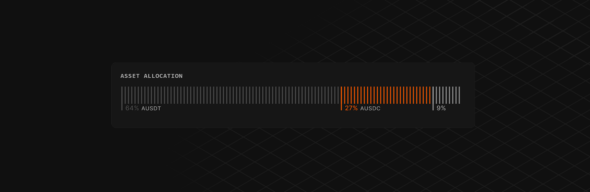

# Portfolio


The Portfolio will show created positions. Refer to [beta.md](beta.md "mention") and [liquidity.md](liquidity.md "mention")


The [Portfolio](https://alphix.fi/portfolio) page offers a full overview of the connected user's activity in one place. It’s designed to make complex liquidity positions understandable at a glance and actionable in a click.

<figure><figcaption></figcaption></figure>



**Position Value**

<mark style="color:$info;">The top left shows the aggregate value of all liquidity positions across</mark> <mark style="color:$info;"></mark><mark style="color:$info;">**Unified Pools**</mark><mark style="color:$info;">, updated in real time. Below, users can see the 24h performance both in dollar value and percentages.</mark>



**Position Stats**

T<mark style="color:$info;">his small component shows three central numbers. The number of positions, the Net APY across all positions, weighted by the exposure and unclaimed fees.</mark>


A single Claim Fees button will be added in the upcoming Beta v1.2 update to simplify claiming




**Asset Allocation View**

<mark style="color:$info;">A central question with multi-position liquidity provision is the exact exposure a user has to the different tokens at each time. This segment answers this at a glance.</mark>

<figure><figcaption></figcaption></figure>

<mark style="color:$info;">Users can see what percentage of their portfolio is in which token. By hovering over the segments, they sort the listed positions by the token. By clicking on a segment, this token filter can be locked and hovering over other tokens shows the positions that involve both tokens.</mark>



**Position List**

<mark style="color:$info;">At the centre of the page is a complete breakdown of the positions the connected user holds. It shows the Position Cards, which also exist in</mark> [liquidity.md](liquidity.md "mention")<mark style="color:$info;">. They hold the current value, price range, unclaimed fees and enable liquidity actions and fee claiming without leaving the page.</mark>

<mark style="color:$info;">Users can switch the view from 'Active Positions' to 'Activity' to show a list of recent transactions on Alphix, including Swaps, Liquidity Modifications and Faucet claims.</mark>&#x20;



**Balances**

<mark style="color:$info;">On the right of the page is a snapshot of the token balances in the user's wallet that are available to swap or deploy into</mark> <mark style="color:$info;"></mark><mark style="color:$info;">**Unified Pools**</mark><mark style="color:$info;">.</mark> &#x20;


