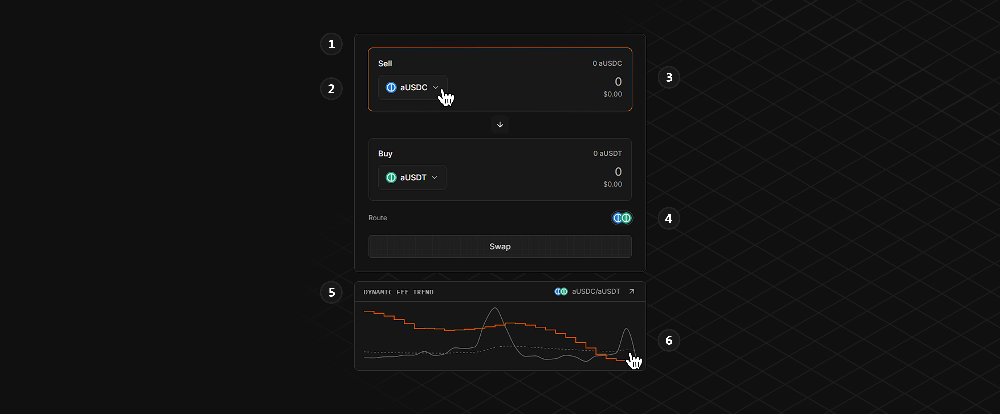
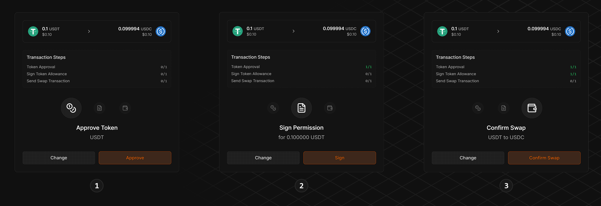

# Swap Tokens

#### **UI Elements**

<figure><figcaption></figcaption></figure>



**Swap Interface**



**Token Selection**

<mark style="color:$info;">Select from a growing selection of tokens as new Unified Pools launch.</mark>



**Input Amount**

<mark style="color:$info;">Users can specify either the token input or the token output to swap to a predefined amount of tokens.</mark>



**Multi-Hop Routes**

<mark style="color:$info;">The swap interface displays the route a swap takes. This can be as simple as a set of two tokens or more complex if there is no existing Unified Pool with the selected tokens. In that case, the swap is routed through multiple pools. The tokens can be hovered over to switch between the different dynamic fee trend views.</mark>



**Dynamic Fee Trend**

<mark style="color:$info;">The dynamic fee trend is a graph plotting the recent 30-day trend to provide additional context for the current fee. This allows swappers to understand the context in which they are swapping, which informs trading decisions.</mark>



**Liquidity Page Shortcut**

<mark style="color:$info;">Clicking on the dynamic fee trend segment takes the user directly to the liquidity page of the corresponding pool, which provides deeper analytics - more information in</mark> [liquidity.md](liquidity.md "mention")<mark style="color:$info;">.</mark>



#### Performing the First Swap

Alphix uses [Permit2](https://github.com/dragonfly-xyz/useful-solidity-patterns/tree/main/patterns/permit2) to streamline approvals. During the initial swap, this requires three steps.

<figure><figcaption></figcaption></figure>



**Approve Permit2**

<mark style="color:$info;">This grants Permit2 the authority to manage token approvals through a single, secure contract. The user retains the power to decide what amount of tokens to approve; by default, the connected wallet will prompt infinity.</mark>



**Sign Token Permit**

<mark style="color:$info;">After the Permit2 Contract is approved to access tokens, a permit has to be signed enabling it to interact with the PoolManager using the user's tokens. This signature has a deadline set at 30 minutes and only enables the exact swap amount to be accessed.</mark>



**Execute the Swap**

<mark style="color:$info;">As the final step, the Swap Modal prompts the swap transaction to the user.</mark>



After the initial setup with Permit2, the user can swap with two transactions if an unlimited Permit2 allowance was approved. By default, Alphix will prompt the user to sign a permit that is only for the selected swap amount and will expire after 24 hours. Subsequent swaps or swaps after expiry of Permit2 require a new signature but no approval transaction, freeing the user from paying gas fees while remaining secure.


The Approval amounts as well as slippage and deadline preferences can be set in the Settings page.

