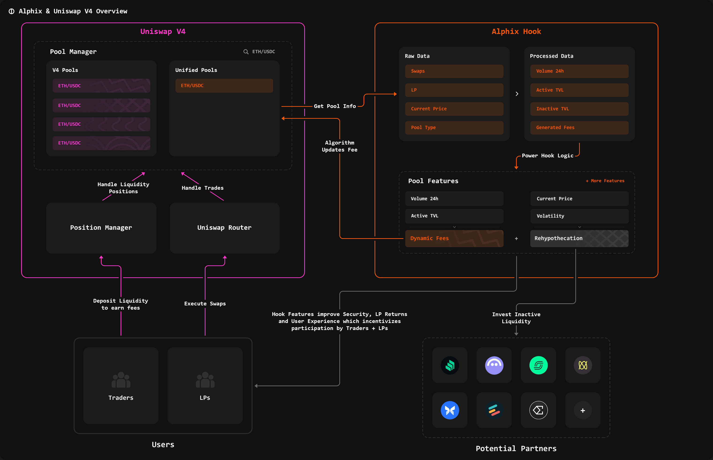
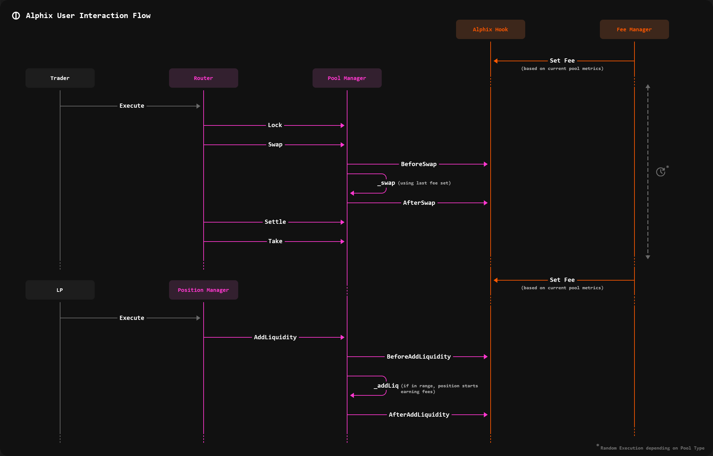

# High-Level Architecture

The illustration below shows how the <mark style="color:$info;">Alphix Hook</mark> connects with **Uniswap v4**, users, and external partners. By building directly on the protocol, Alphix introduces new financial products and capabilities that synergistically enhance the entire Uniswap ecosystem.

<figure><figcaption></figcaption></figure>

On the left is the <mark style="color:$primary;">**Uniswap V4**</mark> infrastructure consisting of Pool Manager, Position Manager and Router. **Unified Pools** are launched on top of this infrastructure, but they rely on the single, shared **Alphix Hook** that adds powerful products.

The illustration below shows user interaction flows to explain how Alphix works in tandem with Uniswap. It traces the process from a trader's (and Liquidity Provider's) initial action through the stack to the **Alphix Hook**, which interacts with a **Fee Manager** to enable the Dynamic Fee feature.

<figure><figcaption></figcaption></figure>


Depending on the feature, the Alphix Hook requires an externally owned address to call functions. In the Dynamic Fee product, this role is filled by a Fee Manager who executes the algorithm randomly depending on Pool Type.

